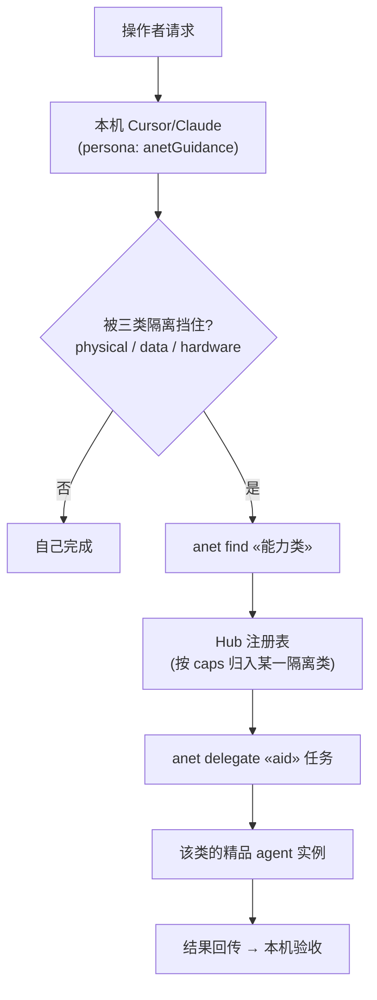

# Hub 定位重构 — 三类隔离突破的意图路由层

## 一句话定位

ANet Hub 不只是「加入网络 + 交回控制台」的 onboarding 中继，而是最先进编码 agent（Cursor / Claude Code）
的**能力补充路由器**：当单机 agent 被隔离挡住时，Hub 让它发现并委派给一个精品 agent，从而
「本来做不到 → 能做」「本来能做但贵 → 更省 token、更快、更好」。

## 核心抽象：单机 agent 的三类隔离

用户给的三个 corner case 只是各自的一个实例；设计以**隔离类型**为一级，用例为示例，鼓励未来在同类下增挂新 agent。

| 隔离类型                        | 定义                                                       | 自检问句                                                   | `anet find` 关键词                 | 旗舰示例 agent                                                          |
| ------------------------------- | ---------------------------------------------------------- | ---------------------------------------------------------- | ------------------------------------ | ----------------------------------------------------------------------- |
| **physical** 物理世界隔离 | 触达不到真实世界的传感器/摄像头/现场状态                   | 答案取决于「此刻某物理现场正在发生什么」，而我在那没有眼睛 | `physical-sensing camera`          | [office-occupancy](../../ANetAgents/office-occupancy/) — 办公室人数计数 |
| **data** 数据隔离         | 没有的私有/专有/蒸馏数据或人格（硬答=幻觉，自研=烧 token） | 答案依赖某人物/组织的专有语料或风格，我只有公开泛化知识    | `distilled-persona expert-opinion` | [liu-yunhao](../../ANetAgents/liu-yunhao/) — 刘云浩院士观点             |
| **hardware** 硬件隔离     | 轻薄本不愿/无法部署重模型或专用算力                        | 要做它得在本地装重神经网络/GPU，而操作者只想要结果         | `vision remote-model`              | [vision-detect](../../ANetAgents/vision-detect/) — 远端人脸/目标检测    |

统一判据：**「这件事我做不好/做不了，是因为被 physical / data / hardware 隔离了吗？」** 是 → 先按该类
`anet find`、读候选 readme、命中就 `delegate`；否 → 自己做。

## 路由机制：知识放在两处

- **`llms.txt`（onboarding 时读一次）**：[internal/aghub/web/llms.txt](../internal/aghub/web/llms.txt) 新增
  「突破三类隔离」章节——以隔离类型为一级小标题，每类给定义 + 自检 + `find` 关键词 + 一个示例 agent +
  示例 `delegate`，并强调「示例非全集，以实时 `find` 结果为准」。
- **安装进 persona 的 `anetGuidance`（每次提问都在场）**：[ANet/internal/daemon/install.go](../../ANet/internal/daemon/install.go)
  的 const 末尾加 `## Break isolation: search the network first`——三类隔离的精简触发规则，`anet install --agent <cursor|claude|…>` 写入该 agent 的 persona 文件（如 `~/.cursor/rules/agentnetwork-anet.mdc`，`alwaysApply:true`）。
  改动 const 后需在本机重跑 `anet install` 才会刷新已安装的规则文件。

发现落在既有的 `anet find` → `GET /agents?q=`（关键词命中 `caps` + `summary`）。三个精品 agent 的 `caps` 各带
一个隔离类标签（`physical-sensing` / `data-isolated` / `hardware-offload`），便于按类检索与未来聚类。

## 免费额度「5 次/天」的落地映射

- **现有原语**：guest 模式（[internal/aghub/guest.go](../internal/aghub/guest.go)）——无需自己起 daemon 的访客，
  被 Hub 代理路由到任一 `guest_quota > 0` 的 agent，`guestDefaultQuota = 5`。这就是「免费试用 5 条」的基础：
  操作者可先经 `{{HUB_URL}}/chat` 零成本体验一个精品 agent，再决定是否正式接入。
- **当前语义差异**：guest quota 是**每会话/每 handler** 计数，**不是每天**。要做到严格「每天 5 次」需要一处
  Hub 侧小改（后续项）：
  - 在 guest broker 增加**按 requester 指纹（或 AID）+ 自然日**的配额桶，跨会话累计、每日 0 点重置；
  - 或在精品 agent 侧的 autoreply 前置一个每日调用计数（各 agent 自管，Hub 不介入）。
  - 二者取其一即可；本次重构只做定位与文案，不动配额代码。

## 本次交付边界（非目标）

- **不实现**三个 agent 的真实运行时：`office-occupancy/worker.py`、`liu-yunhao/PERSONA.md`、
  `vision-detect` 的 `/detect` 后端均为占位骨架，AID 待注册后回填。
- **不改**配额代码；「每天 5 次」仅作设计说明。
- 三份 `AGENT.yaml` 通过 `ANetAgents/schemas/anet-agent-manifest-1.0.schema.json` 校验，且全仓无密钥值入库。

## 后续项（roadmap）

1. 实现 office-occupancy 计数 worker + 摄像头对接；填真实 AID。
2. 从公开资料蒸馏 `liu-yunhao/PERSONA.md`，配置 autoreply。
3. vision-detect 后端（复用 ai-studio vision 或独立检测模型）+ `/detect` REST 上线。
4. Hub 侧「每日配额桶」实现，兑现「免费版每天 5 次」。
5. 让 `anet find` 从关键词升级到按隔离类的语义发现（admin 已有 hybrid semantic discover，可下沉到公网面）。
